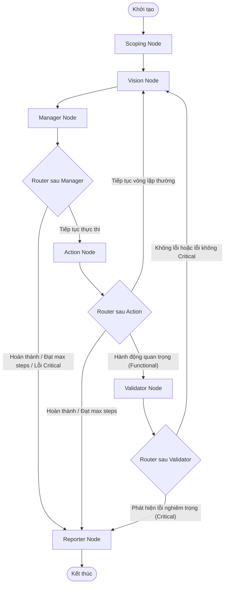

# Luồng Hoạt Động Chi Tiết - Hệ Thống Multi-Agent Vision Web Tester

Tài liệu này mô tả chi tiết luồng hoạt động của dự án **AI-Agent-Tester**, một hệ thống kiểm thử tự động đa tác tử (Multi-Agent) sử dụng thị giác máy tính và điều khiển trình duyệt. Tài liệu này cung cấp ngữ cảnh đầy đủ để phân tích hệ thống.

---

## 1. Tổng Quan Kiến Trúc (LangGraph Workflow)
Hệ thống sử dụng thư viện **LangGraph** để xây dựng sơ đồ luồng (Workflow Graph) kiểm thử tự động. Vùng nhớ chung **AgentState** đóng vai trò là nơi lưu trữ và truyền trạng thái qua lại giữa các Node chuyên biệt dưới đây:

1. **Scoping Node**: 
   - Chạy một lần duy nhất lúc khởi tạo hệ thống (được bảo vệ bằng cờ `_scoped`).
   - Phân tích yêu cầu (`goal`) và dữ liệu test case (`test_case_data`) để xác định phạm vi kiểm thử (`ui`, `functional`, `security`), kích thước màn hình (`viewport` - pc/mobile), và danh sách các điểm kiểm thử quan trọng (`checkpoints`).
   - Trích xuất thông tin tài khoản đăng nhập được cung cấp vào `PROVIDED_CREDENTIALS`.
   - Khởi tạo kế hoạch thực hiện (`task_plan`) gồm danh sách các bước cần làm với trạng thái ban đầu là `"todo"`.
2. **Vision Node**:
   - Chờ trang web tải xong và ổn định (mạng rảnh, không có thay đổi DOM lớn).
   - Chụp ảnh màn hình trang web hiện tại (lưu dưới dạng Base64 JPEG trong `screenshot`).
   - Quét DOM để thu thập danh sách các phần tử tương tác (`dom_elements`), hỗ trợ gắn nhãn SOM (Set-of-Mark) phục vụ định vị thị giác.
3. **Manager Node**:
   - Đóng vai trò "não bộ" đưa ra kế hoạch và quyết định hành động tiếp theo.
   - Gom thông tin từ Vision Node (ảnh chụp + DOM) kết hợp với lịch sử hội thoại gửi tới mô hình AI (`brain_model`).
   - LLM sinh ra các lệnh hành động tiếp theo (Tool Calls) trong `next_action`, đồng thời cập nhật trạng thái các bước trong `task_plan` (`todo`, `done`, `failed`).
4. **Action Node**:
   - Đóng vai trò "cánh tay" thực thi các lệnh tương tác trên trình duyệt (Click, Type, Scroll, Hover, vv.) nhận được từ Manager Node.
   - Nếu gặp lỗi thực thi hoặc phát hiện trình duyệt chuyển hướng trang ngoài dự kiến, Action Node sẽ dừng chuỗi hành động sớm để quay lại Vision Node cập nhật lại trạng thái.
   - Tăng số bước đã chạy (`current_step_count`) để kiểm soát số bước tối đa.
5. **Validator Node**:
   - Đóng vai trò "giám sát viên QA" kiểm tra kết quả ngay sau các hành động quan trọng (các hành động click/type chứa từ khóa như: *login, submit, save, delete, confirm, upload...*).
   - Gọi mô hình đánh giá (`eval_model`) phân tích ảnh chụp màn hình và DOM hiện tại để so sánh kết quả thực tế (Actual Result) với mong đợi (Expected Result).
   - Áp dụng bộ quy tắc **Visual Tolerance** (Dung sai hiển thị) để bỏ qua các sai lệch đồ họa nhỏ do khác biệt môi trường kết xuất (HĐH macOS vs Linux), tránh báo lỗi giả.
   - Phân loại lỗi thành các mức độ nghiêm trọng: `Critical`, `Major`, `Minor`, `Trivial`. Nếu phát hiện lỗi, hệ thống sẽ bật cờ `is_bug = True` và ghi nhận `severity`.
6. **Reporter Node**:
   - Chạy ở cuối quy trình kiểm thử (khi hoàn thành nhiệm vụ, đạt giới hạn bước tối đa `max_steps`, hoặc Validator phát hiện lỗi nghiêm trọng `Critical` cần dừng khẩn cấp).
   - Tổng hợp toàn bộ dữ liệu kiểm thử (validation_results, findings, history) và gọi `eval_model` tạo báo cáo dạng JSON (`final_report`) bằng tiếng Việt.
   - Gọi hàm xuất báo cáo Excel v3 (`generate_excel_report_v3`) tự động tạo file báo cáo gồm 3 sheets chi tiết: Tóm tắt chung (Summary), Nhật ký lỗi (Defect Log), và Nhật ký chi tiết các bước kiểm thử.
   - Giải phóng tài nguyên và đóng trình duyệt để tối ưu bộ nhớ.

---

## 2. Chi Tiết Vùng Nhớ Chung (AgentState)
Mọi thông tin trong Graph được chia sẻ và đồng bộ qua `AgentState`. Cấu trúc chi tiết gồm các trường sau:

*   **Thông tin chung (Core)**:
    *   `model_name`: Tên model mặc định (tương thích ngược).
    *   `goal`: Mục tiêu/nhiệm vụ kiểm thử do người dùng nhập vào.
    *   `url`: URL đích ban đầu của trang web cần kiểm thử.
    *   `base_url`: Domain root của trang web (dùng để kiểm soát phạm vi truy cập an toàn).
*   **Cấu hình Model động (Dynamic Model Config)**:
    *   `model_config`: Lưu thông tin `brain_model` (dùng cho Manager đưa ra quyết định hành động) và `eval_model` (dùng cho Scoping, Validator, Reporter).
*   **Thông tin Scope (QA Scoping)**:
    *   `test_scope`: Cấu hình chiến lược test gồm các cờ `ui`, `functional`, `security`, loại thiết bị `viewport`, và danh sách checkpoint cần validate.
    *   `test_case_data`: Dữ liệu kịch bản kiểm thử (steps, expected_results, preconditions).
*   **Kết quả Đánh giá (Validation)**:
    *   `validation_results`: Danh sách bản ghi các bước kiểm tra (gồm checkpoint, trạng thái pass/fail, kết quả thực tế, kết quả mong đợi, sự sai lệch, và ảnh bằng chứng).
    *   `is_bug`: Cờ đánh dấu lượt validate vừa rồi có phát hiện lỗi hay không.
    *   `severity`: Mức độ nghiêm trọng của lỗi gần nhất (`Critical` | `Major` | `Minor` | `Trivial`).
*   **Thông tin Quan sát (Perception)**:
    *   `screenshot`: Ảnh chụp màn hình hiện tại (chuỗi Base64 JPEG).
    *   `dom_elements`: Danh sách các phần tử HTML tương tác được trích xuất từ trang web.
*   **Quyết định & Lịch sử (Decision & History)**:
    *   `next_action`: Danh sách các Tool Calls do Manager yêu cầu Action Node thực hiện.
    *   `messages`: Lịch sử các tin nhắn hội thoại ReAct với LLM.
    *   `history`: Nhật ký các hành động hiển thị trên giao diện Streamlit (được tiền tố bằng tên Node).
    *   `findings`: Danh sách lỗi chi tiết để tổng hợp lên báo cáo (gồm tiêu đề, chi tiết lỗi, mức độ nghiêm trọng, URL phát hiện, thời gian, và đường dẫn ảnh lưu trữ).
    *   `last_thought`: Ý nghĩ hoặc phân tích gần nhất của AI để hiển thị trực tiếp lên UI.
    *   `task_plan`: Kịch bản kiểm thử động gồm danh sách các bước dạng `[{"step": "...", "status": "todo|done|failed"}]`.
    *   `final_report`: Dữ liệu báo cáo tổng hợp cuối cùng.
*   **Điều khiển & Giới hạn (Control)**:
    *   `is_complete`: Đánh dấu tác vụ hoàn thành.
    *   `last_action_location`: Vị trí tương tác trước đó (được hiển thị vòng tròn đỏ trên screenshot ở UI).
    *   `current_step_count`: Số bước vòng lặp Manager -> Action đã thực hiện.
    *   `max_steps`: Số bước chạy giới hạn (mặc định 50).
*   **Thông tin Xác thực (Auth & Counters)**:
    *   `login_user` / `login_pass`: Thông tin tài khoản và mật khẩu đăng nhập.
    *   Các bộ đếm bảo vệ: `_api_error_count` (lỗi kết nối API liên tiếp), `_empty_count` (phản hồi rỗng liên tiếp), `_last_actions` (lịch sử lưu vết phát hiện lặp vô hạn).

---

## 3. Luồng Định Tuyến (Routing Logic & Mermaid Diagram)

Sơ đồ hoạt động và định tuyến các Node trong LangGraph được thể hiện như sau:

### Quy tắc định tuyến chi tiết:
1.  **Sau Manager Node (`route_after_manager`)**:
    *   Chuyển thẳng tới **Reporter Node** nếu tất cả các bước trong `task_plan` đã ở trạng thái hoàn thành (`done` hoặc `failed`), hoặc số bước đạt giới hạn `max_steps`, hoặc phát hiện lỗi mức `Critical` từ Validator trước đó, hoặc khi AI kết thúc tác vụ và bật cờ `is_complete`.
    *   Chuyển tới **Action Node** trong các trường hợp bình thường khác để thực thi lệnh.
2.  **Sau Action Node (`route_after_action`)**:
    *   Tăng biến đếm `current_step_count` thêm 1.
    *   Chuyển tới **Reporter Node** nếu hoàn thành mọi bước, đạt giới hạn số bước tối đa, hoặc phát hiện lỗi `Critical`.
    *   Chuyển tới **Validator Node** để thẩm định kết quả nếu hành động vừa thực hiện là một "hành động quan trọng" (ví dụ: login, submit form, save, delete, upload...) và kiểm thử chức năng (`functional`) đang được bật.
    *   Quay lại **Vision Node** nếu chỉ là các hành động điều hướng hoặc tương tác thông thường để tiếp tục quan sát.
3.  **Sau Validator Node (`route_after_validator`)**:
    *   Nếu phát hiện lỗi có mức độ nghiêm trọng là `Critical`, hệ thống sẽ kích hoạt cơ chế ngắt sớm (short-circuit) và chuyển thẳng tới **Reporter Node** để dừng bài test và báo cáo.
    *   Nếu không có lỗi hoặc lỗi ở mức độ nhẹ hơn (`Major`, `Minor`, `Trivial`), hệ thống quay lại **Vision Node** để tiếp tục hành trình kiểm thử bình thường.

---

## 4. Các Cơ Chế Đặc Biệt Của Hệ Thống
*   **SOM Visual Grounding (Set-of-Mark)**: Hệ thống sử dụng kỹ thuật gán nhãn số (tọa độ/vùng tương tác) trực tiếp lên ảnh chụp màn hình. AI dựa vào các nhãn này để xác định vị trí click hoặc type, giúp khắc phục nhược điểm định vị sai lệch của các selector DOM truyền thống.
*   **Vision-First & Coordinate Fallback**: Trong trường hợp phần tử giao diện không chứa các thuộc tính định danh rõ ràng như `id`, `class` trong DOM, AI có thể tính toán và ra lệnh tương tác trực tiếp dựa trên tọa độ X,Y của ảnh hiển thị (quy chuẩn theo kích thước ảnh chụp).
*   **Data Safety (🚨 Nguyên tắc An toàn Dữ liệu — BẮT BUỘC TUYỆT ĐỐI)**:
    - **Tài khoản & dữ liệu người dùng cung cấp là CHỈ ĐỌC (READ-ONLY)**: Agent tuyệt đối không được sửa, xóa, hay thay đổi bất kỳ thông tin nào (email, mật khẩu, vai trò, quyền, dữ liệu sẵn có) của tài khoản admin hoặc bất kỳ dữ liệu nào đã tồn tại trước khi Agent bắt đầu chạy.
    - **Quy tắc hậu tố `_AI_AGENT_TEST`**: Mọi dữ liệu Agent tự tạo ra trong phiên kiểm thử (tài khoản, bản ghi, tài liệu, dự án) đều PHẢI có hậu tố `_AI_AGENT_TEST`. Agent chỉ được sửa/xóa những dữ liệu mà chính nó đã tạo ra trong phiên đó.
    - **Test chức năng chỉnh sửa/xóa**: Nếu kịch bản kiểm thử yêu cầu test tính năng sửa/xóa thông tin tài khoản (đổi mật khẩu, cập nhật profile, thay đổi quyền...), Agent phải: (1) đăng xuất khỏi tài khoản được cung cấp, (2) tự đăng ký một tài khoản mới với email chứa `_AI_AGENT_TEST`, (3) thực hiện toàn bộ kiểm thử chỉnh sửa trên tài khoản mới đó.
*   **Visual Tolerance (Dung sai Hiển thị)**: Validator tự động bỏ qua các lỗi hiển thị siêu nhỏ (dưới 3-5px lệch căn lề, độ đậm nhạt của font chữ do khử răng cưa của hệ điều hành, hay bóng mờ chênh lệch nhẹ) để đảm bảo không bị nghẽn bởi các yếu tố kết xuất cross-platform.
*   **Enforcing Automated Task Planning & Live Status**: Hệ thống bắt buộc phải duy trì một `task_plan` hoạt động. Trạng thái của từng bước được hiển thị trực tiếp và liên tục trên UI (✅ tích xanh cho 'done', ❌ đỏ cho 'failed') giúp người dùng dễ dàng theo dõi tiến độ chạy của Agent.
*   **Cơ chế Dual-Model (Tối ưu hóa Chi phí và Hiệu năng)**:
    *   `brain_model`: Sử dụng các mô hình ngôn ngữ lớn mạnh mẽ nhất (như *Gemini 2.5 Pro*, *Gemini 2.5 Flash*) phục vụ Manager Node để đảm bảo suy luận logic, hiểu giao diện hình ảnh phức tạp và lập kế hoạch hành động chính xác.
    *   `eval_model`: Sử dụng các mô hình có chi phí thấp và tốc độ phản hồi cực nhanh (như *Gemini 3.1 Flash Lite*) cho các Node phụ trợ Scoping, Validator, và Reporter nhằm kiểm tra kết quả nhanh chóng và giảm thiểu token tiêu thụ.
*   **Xử lý lỗi Validation Form (Form Validation Error Recovery)**: Khi việc submit form hoặc click lưu bị lỗi do thiếu thông tin hoặc sai định dạng (giao diện hiển thị thông báo lỗi như "Vui lòng chọn...", "Vui lòng nhập..."), Agent tuyệt đối không được bấm nút "Hủy" hoặc đóng popup để làm lại từ đầu. Thay vào đó, Agent phải giữ nguyên trạng thái form, xác định các trường bị thiếu/lỗi, thực hiện tương tác để bổ sung/sửa đổi thông tin, rồi bấm nút "Lưu" (Save/Submit) lại ngay tại chỗ để tiếp tục luồng kiểm thử.

---

## 5. Luồng Sinh Test Case Tự Động Từ Tài Liệu Đặc Tả
Hệ thống tích hợp quy trình sinh kịch bản kiểm thử (Test Case) tự động từ tài liệu nghiệp vụ trước khi chạy kiểm thử chính thức:

1.  **Tải lên Tài liệu**: Người dùng tải tài liệu đặc tả yêu cầu nghiệp vụ lên Streamlit UI. Hỗ trợ các định dạng file Excel (`.xlsx`, `.xls`), CSV (`.csv`), Word (`.docx`), Markdown (`.md`), hoặc JSON (`.json`).
2.  **Trích xuất Văn bản (`doc_parser.py`)**:
    *   *Excel/CSV*: Đọc tất cả các sheet dữ liệu thông qua thư viện `pandas`, loại bỏ các dòng trống gây nhiễu, xuất dữ liệu dạng chuỗi văn bản phân tách bằng tab.
    *   *Word*: Sử dụng `python-docx` để trích xuất văn bản từ các đoạn văn (paragraphs) và các bảng dữ liệu (tables).
    *   *Markdown/JSON*: Đọc và xử lý văn bản trực tiếp.
3.  **Sinh Test Case bằng AI (`testcase_generator.py`)**:
    *   Hệ thống chuyển toàn bộ văn bản đặc tả đã trích xuất kèm theo prompt hệ thống `QA_SYSTEM_PROMPT` (Universal QA Engineer V3) tới mô hình AI được chỉ định.
    *   AI hoạt động như một Chuyên viên QA cao cấp phân tích các nghiệp vụ, ràng buộc dữ liệu, khóa ngoại, các case biên (Boundary Value Analysis), Happy Path, Negative Path để sinh ra bộ Test Case hoàn chỉnh.
    *   Kết quả trả về được xuất ra dưới dạng **bảng Markdown bằng Tiếng Việt** gồm các cột: `ID`, `Component`, `Scenario Type` (Loại kịch bản), `Preconditions` (Điều kiện tiên quyết), `Steps` (Các bước thực hiện), `Expected Result (UI & DB/API State)` (Kết quả mong đợi), và `Severity` (Mức độ nghiêm trọng).
4.  **Nạp và Chạy**:
    *   Streamlit UI hiển thị bảng kịch bản kiểm thử trực quan. Người dùng có thể chỉnh sửa hoặc xác nhận nạp kịch bản này.
    *   Khi nạp thành công, hệ thống chuyển đổi kịch bản kiểm thử này thành `task_plan` khởi đầu trong `AgentState` để Agent ưu tiên bám sát thực hiện bài test theo đúng quy trình nghiệp vụ đã đề ra.
